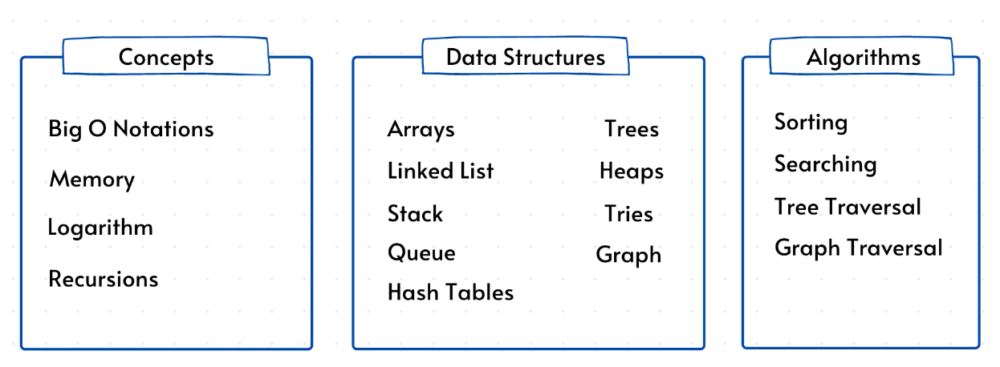

# go_dsa

Data Structures and Algorithms in GOlang 

## TOOLS

1. https://visualgo.net/en
2. https://www.cs.usfca.edu/~galles/visualization/Algorithms.html
	* https://www.cs.usfca.edu/~galles/visualization/RedBlack.html