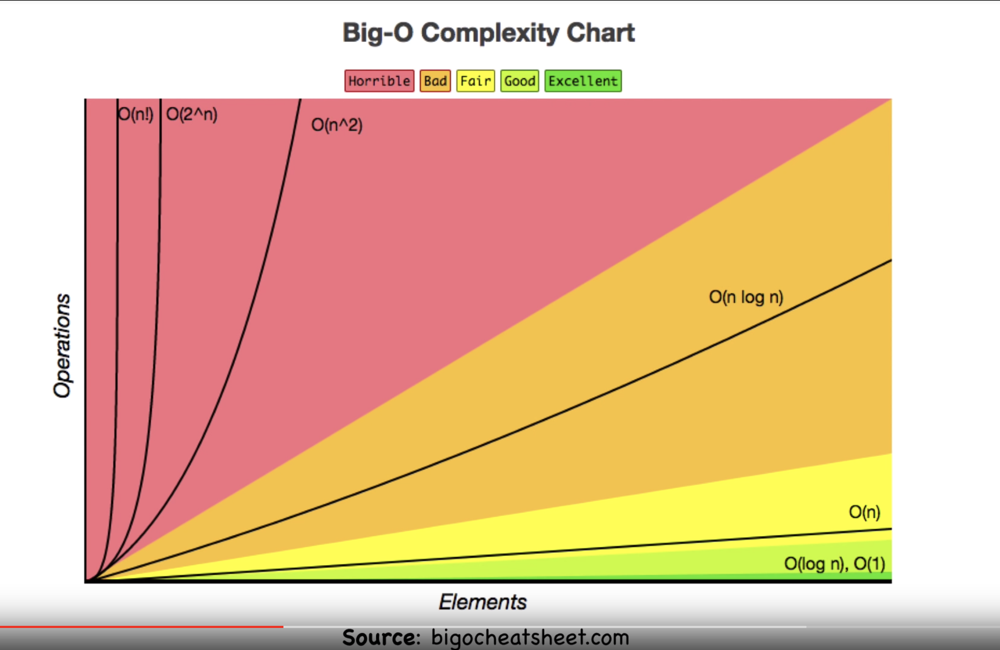
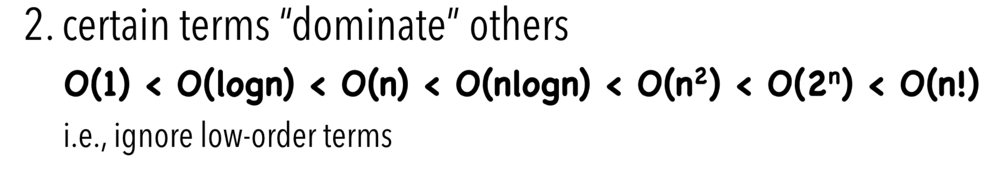

# Big O

*Big O* notation is used in Computer Science to describe the performance or complexity of an algorithm. 

*Big O* is used to describe the execution time required or the space used (e.g. in memory or disk) by an algorithm.

To measure the efficiency of an algorithm, we need to consider two things:

1. *Time complexity* - How much time does it take to run completely?

2. *Space complexity* - How much extra space does it require in the process?
   

It doesn't depends on time by itself, it depends on how many steps we are performing

The main focus is to calculate the amount of work we do or the mumber of comparisons we perform.

