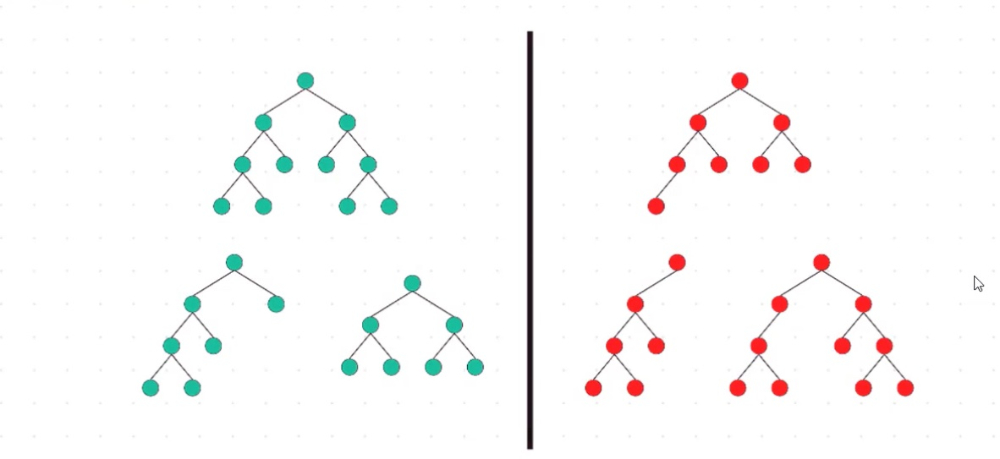
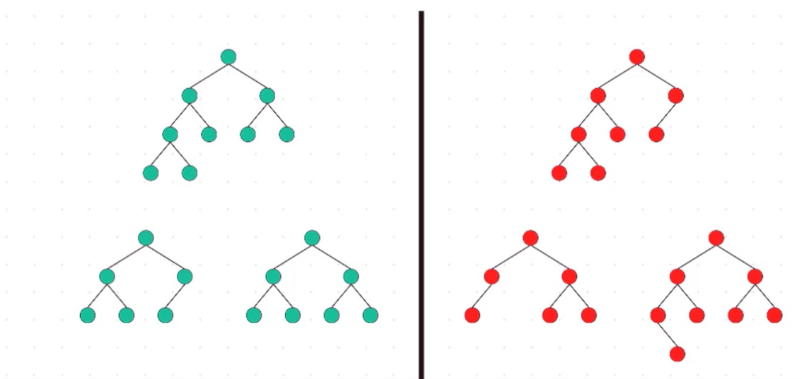
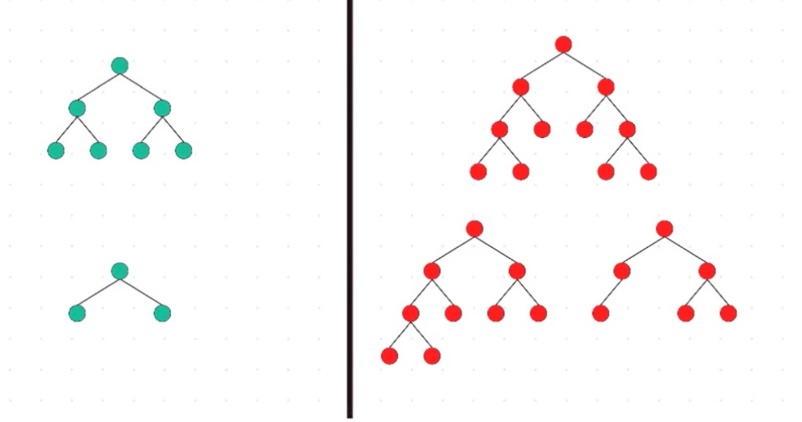
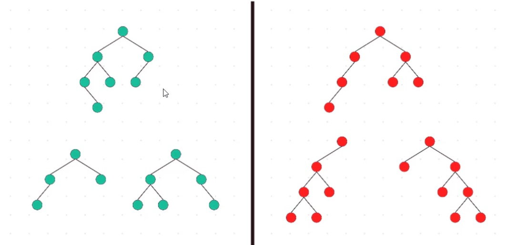
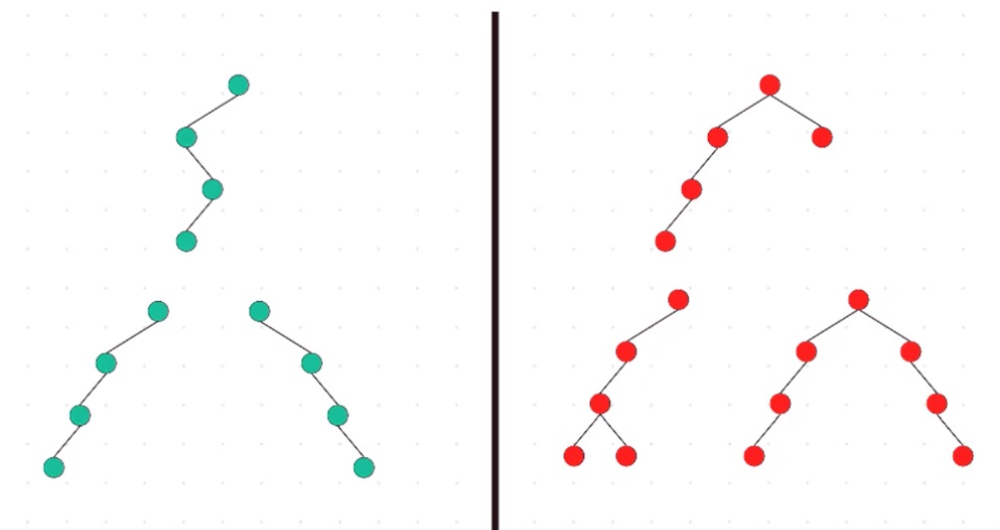

# Binary Tree

## Types of Binary Tree

### Full Binary Tree

Binary Tree in whih every node has 0 or 2 children

### Complete Binary Tree

All levels completely filled with nodes except the last level and in the last level, all the nodes are as left side as possible

### Perfect Binary Tree

Binary Tree in which all internal nodes have 2 children and all leaf nodes are the same depth or same level

### Balanced Binary Tree

Binary Tree in which height of the left and the right sub-trees of every node may differ by at most 1

### Degenerate Binary Tree

Binary Tree where every parent node has only one chield

