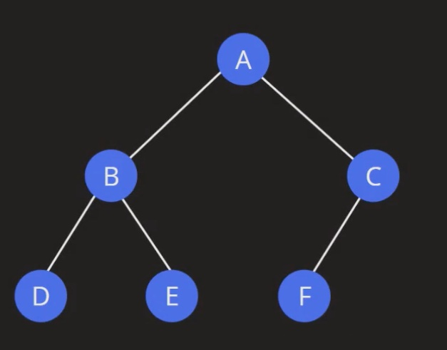

# Tree Taversal

## BFS
- Level Order



```
[A, B, C, D, E F]	
```

## DFS

### PRE ORDER
- ROOT > LEFT > RIGHT


```
[A, B, D, E, C, F]
```

### IN ORDER
- LEFT > ROOT > RIGHT


```
[D, B, E, A, F, C]
```

### POST ORDER
- LEFT > RIGHT > ROOT


```
[D, E, B, F, C, A]
```